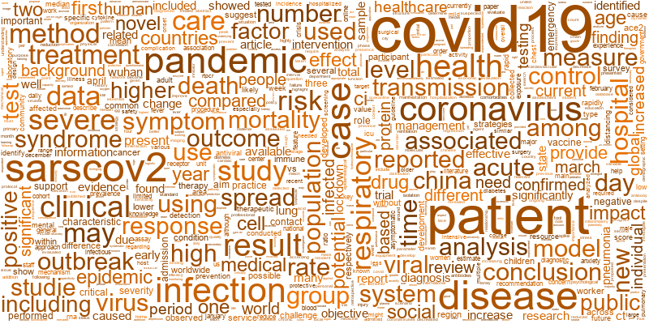

# CORD-19 NLP Project

## Outline

Data Exploration
 - [Exploring the raw data](Code/COVID_Pubs_Wk_4.ipynb)

Dataset prep 
 - [Filtering data within in MongoDB](Code/MongoDB_Initial_Cleaning.ipynb)
 - [Creating the working dataset](Code/Lesson6_Assigment_Amit_1001.ipynb)

Data Preprocessing for Text Analyses
 - [Further Text Preprocessing to prepare for modelling](Code/wk8_Preprocess_Text.ipynb)
 - [POS tagging and removal](Code/wk10_Final.py)

Models
 - [Sentiment Analysis](Code/Initial_Sentiment_Analyses.ipynb)
 - [TD-IDF and LDA Models](Code/LDA_abstract_final.ipynb)
 - BERT
   - [Embeddings](Code/embeddings.py)
   - [HDBSCAN](Code/hdbscan.py)
   - [LDA Classification](Code/classLDA_full.py)
   - [TFIDF](Code/classTFIDF.py)

Final Results and Comparisons
 - [Topic Popularities Over Time](Code/Wk12_Temporal_ClusterAnalysis.ipynb)
 - [Sentiment over time and by cluster](Code/Sentiment_vs_Time.ipynb)
   - [Visualizations](Code/Visuals_Sentiment_and_Networks.R)

## Data Source
Data are from the meta data file for [COVID-19 Open Research Dataset Challenge (CORD-19)](https://www.kaggle.com/allen-institute-for-ai/CORD-19-research-challenge?select=metadata.csv)
